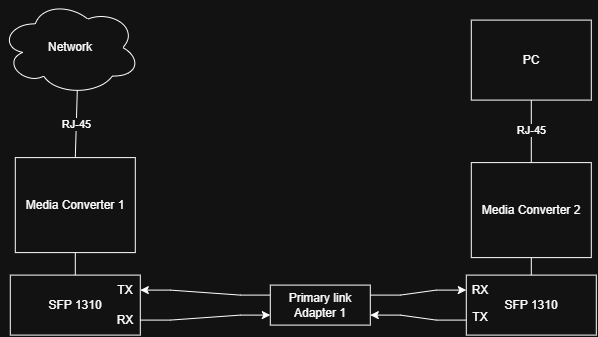
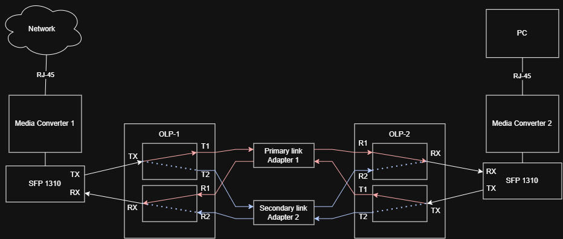

# Практическая работа по теме "Аппаратное резервирование каналов связи в ВОЛС"

## Дополнительные материалы
- [Синтаксис Markdown](./extra/markdown-and-extensions.md)
- [Основные команды и работа в терминале Linux](./extra/cli-commands.md)
- [Система контроля версий Git](./extra/git.md)
- [Network](./extra/network.md)
- [Администрирование информационных систем](https://kisa47.github.io/admin_lections/)

## Требования к выполнению работы

- **OLP** - 2шт
- **Медиаконвертер** с **SFP** портом - 2шт
- **SFP** модуль двухволоконный (1310нм) - 2шт
- Патч-корды оптические **LC-UPC** - **LC-UPC** - 8шт
- Соединительные розетки **LC-UPC** - 2шт
- Патчкорды "витая пара" RJ-45 - 2шт
- ПК

## Цель работы

- Получить первичные навыки работы с ВОЛС
- Получить навыки в аппаратном резервировании оптических линий связи
- Получить навыки в построении ВОЛС

## Проведение лабораторной работы

### Построение сети без аппаратного резервирования

Перед подключением выполнением каких либо действий, необходимо выполнить провекру наличия доступа к сети Интернет и провести трассировку пакетов до узла **vshte.ru**. Сделать это можно командами:

```bash
ping vshte.ru # отправить ICMP запрос
traceroute vshte.ru | tee default_trace.log # выполнит трассировку и сохранит вывод в файл default_trace.log
```

Если доступ есть, то можно приступить к подключению ПК к сети интернет через оптическую линию связи. Для подключения будем использовать медиаконвертеры.  



Патчкорд витая пара, которым осущуствляется подключение ПК до начала выполнения практической работы к сети, будем считать **Up-Link** (подключенным к порту вышестоящего устройства для доступа в сеть Интернет). Медиаконвертер 1 подключаем к **Up-Link**, медиаконвертер используя витую пару подключаем к ПК. Далее соединяем оптическими оптическими патчкордами **SFP** модули обоих медиаконвертеров (Tx модуля одного должен приходить на Rx другого). В случае правильно выполненной коммутации на медиаконвертерах будут гореть (мигать)соответствующие индикаторы. После верного подключения выполним повторную проверку доступности узла **vshte.ru** командами:

```bash
ping -c 10 vshte.ru # отправить ICMP запрос
mtr -r -s 10 vshte.ru | tee optical_trace.log # выполнит трассировку и сохранит вывод в файл default_trace.log
```

Далее выполним сравнение трассировок, чтобы понять на каком уровне модели OSI работают медиаконвертер файлы [default_trace.log](./default_trace.log) и [optical_trace.log](./optical_trace.log).

Далее выполним првоерку реакции системы на обрыв кабеля. Для этого запустим постоянную отправку ICMP запрсоов командой:
```bash
ping -O -c 100 vshte.ru | tee ping_fault.log
```
И не дожидаясь завершения выполнения команды выполним иммитацию разрыва связи отсоединив один из патчкордов. Мы должны увидеть изменение в выводе команды.

### Построение сети с аппаратным резервированием

Далее построим схему с использованием аппаратного резервирования путей передачи данных по схеме: 


Для этого в разрыв между двумя **SFP** модулями подключим два **OLP** устройства. При подключении стоит обратить внимание, что в соединение **OLP** - **SFP** должно осуществляться **TX-TX** и **RX-RX** (без "переворота"), а соединение **OLP** - **OPL** с "переворотом" (T1-R1, T2-R2 и наоборот). Между двумя **OLP** также следует использовать соединительные розетки (адаптеры).

Для проверки правильности подключения необходимо выполнить следующие команды:
```bash
ping -c 10 vshte.ru # отправить ICMP запрос
mtr -r -s 10 vshte.ru | tee olp_trace.log # выполнит трассировку и сохранит вывод в файл default_trace.log
```

Также, чтобы ответить на вопрос, на каком уровне модели OSI работает OLP устройство нужно проанализировать и сравнить вывод команды **mtr** с выводом после подключения медиаконверторв (файлы [optical_trace.log](./optical_trace.log) и [olp_trace.log](./olp_trace.log)).

Далее выполним првоерку реакции системы на обрыв кабеля. Для этого запустим постоянную отправку ICMP запрсоов командой:
```bash
ping -O -c 100 vshte.ru | tee ping_fault_with_olp.log
```
И не дожидаясь завершения выполнения команды выполним иммитацию разрыва связи отсоединив один из патчкордов.

Далее в выводе команды или в файле [ping_fault_with_olp.log](./ping_fault_with_olp.log) необходимо посмотреть, какое время потребовалось системе на восстановление связи при сбое.

### Завершение работы

Заполнить раздел [Полученные результаты](#полученные-результаты), далее сделать ветку с вашим именем и фамилией, например **v.surtsov**, гдеи сделать фиксацию изменений с помощью [Система контроля версий Git](./extra/git.md). Имя коммита задать **Работа выполнена**

## Полученные результаты
- ФИО:
- Группа:

- На каком уровне модели **OSI** работает медиаконвертер?:

- На каком уровне модели **OSI** работает OLP устройство?:

- Какое время понадобилось системе на восстановление связи с OLP?:

